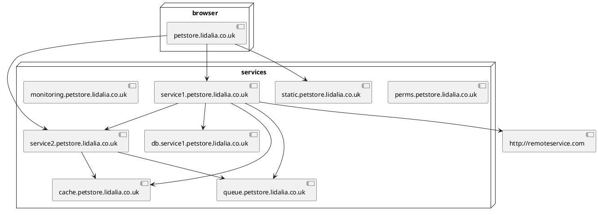

# Lidalia Pet Store

This is a private example of trying to do Everything Right™ for a web
application.

Basic principles:
* Multi-env - can spin up a new env remotely trivially
* Same locally as remote
* Users are identified & authorised
* Everything is monitored & alerted
* On deployment new hashed css / js is added, old is still available

## System diagram

